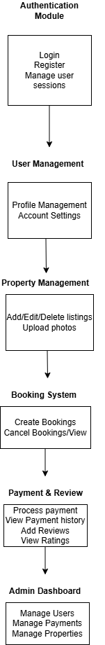

# Airbnb Clone – Features and Functionalities

This document outlines the core features and functionalities of the Airbnb Clone backend project.

## Key Features
- **User Authentication** – Sign up, login, and manage user profiles.
- **Property Listings** – Hosts can create, update, and delete property listings.
- **Booking System** – Guests can book available properties with date validation.
- **Payments** – Integration with payment gateway (e.g., Stripe or PayPal).
- **Reviews** – Users can leave reviews and ratings for properties.
- **Admin Management** – Admins can monitor and manage users, bookings, and listings.

## Diagram
The diagram below represents how the system’s main features and modules interact.

