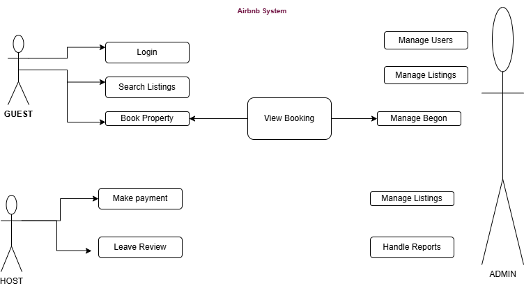

# Airbnb Clone – Use Case Diagram

This diagram illustrates the interactions between key system actors (Guest, Host, and Admin) and the main system functionalities of the Airbnb Clone.

## Key Actors
- **Guest**: Can register, search listings, make bookings, pay for reservations, and leave reviews.
- **Host**: Can create and manage property listings, view bookings, and update availability.
- **Admin**: Oversees system operations by managing users, listings, and bookings.

## System Use Cases
- **Authentication** – For user and host registration/login.
- **Property Management** – For hosts to manage listings.
- **Booking System** – For guests to make reservations.
- **Payment Processing** – For secure transactions.
- **Review System** – For guests to rate their experiences.
- **Admin Dashboard** – For administrators to manage platform data.

